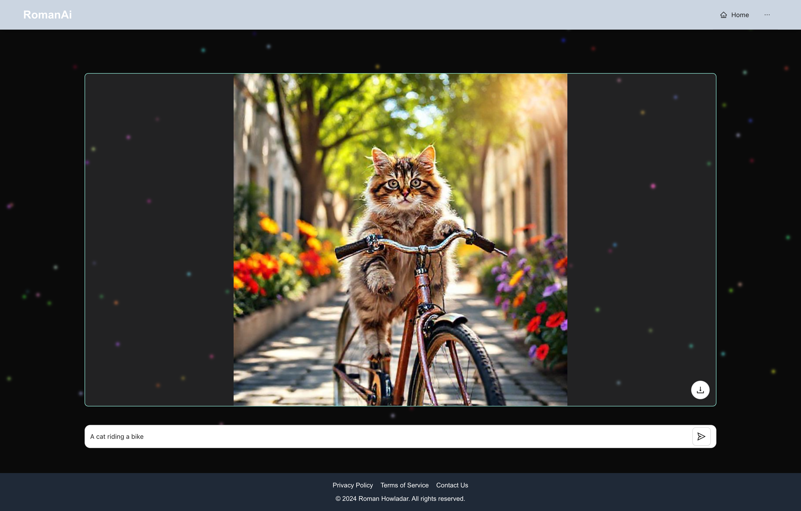

# DEMO

# PromtIt - AI Image Generator

PromtIt is an innovative web application built with Next.js that leverages AI technology to generate images based on user prompts. The application provides a seamless user experience, allowing users to input descriptive text and receive high-quality images in real-time.

## Features

- **User-Friendly Interface**: Intuitive design that allows users to easily input prompts and view generated images. Responsive layout optimized for various devices.

- **Dynamic Interactive Background**: Visually engaging background that enhances the overall user experience, making the interface captivating and immersive.

- **Image Generation**: Integrates with the AI image generation API from **[Pollinations.ai](https://pollinations.ai)** to fetch and display images based on user input.

- **Loading and Error Handling**: Includes loading indicators and error messages to enhance user experience, keeping users informed during the image generation process.

- **Image Download Capability**: Users can easily download generated images with a single click for convenient saving and sharing.

- **Gradient Border Design**: The image display container features an eye-catching gradient border, adding a modern aesthetic to the application.

